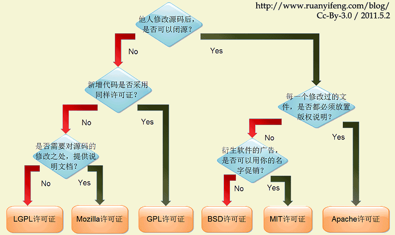

如何为代码选择开源许可证，这是一个问题。

世界上的开源许可证数量在数百种之多。很少有人搞得清楚它们的区别。即使在最流行的六种GPL、BSD、MIT、MPL、Apache License、LGPL也很难选择。

Paul Bagwell

<http://pbagwl.com/post/5078147450/description-of-popular-software-licenses>

阮一峰

<http://www.ruanyifeng.com/blog/2011/05/how_to_choose_free_software_licenses.html>

下图为阮一峰汉化版本

1 我只想安心的写代码，别人爱咋搞咋搞——MIT协议

* 允许别人以任何方式使用
* 署名作者
* 原作者不承担代码使用后的风险

2 我想保留专利，但你们可以随便用——Apache 协议

* 授权使用者免费使用个人专利
* 使用者必须放置协议说明
* 使用者需要对修改部分进行说明
* 禁止用作者的名号进行商业广告
* 原作者不承担代码使用后的风险

3 我希望代码能生根发芽，遍地开花——GPL 协议

* 使用者需要遵循相同的协议进行开源
* 原作者不承担代码使用后的风险

相关链接

<https://linux.cn/article-3752-1.html>

<https://blog.csdn.net/wadefelix/article/details/6384317>